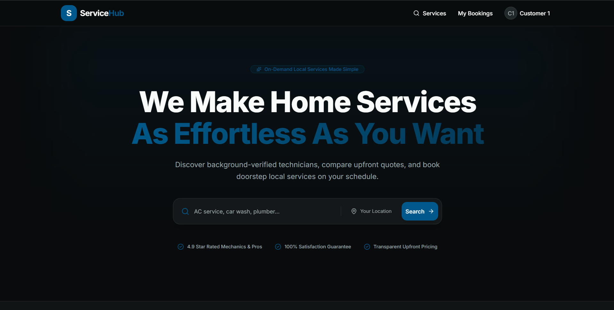
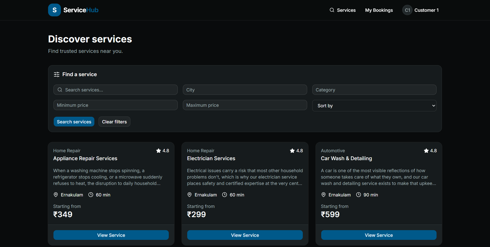
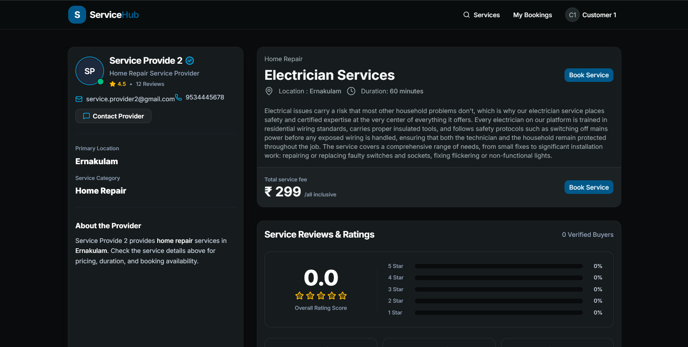
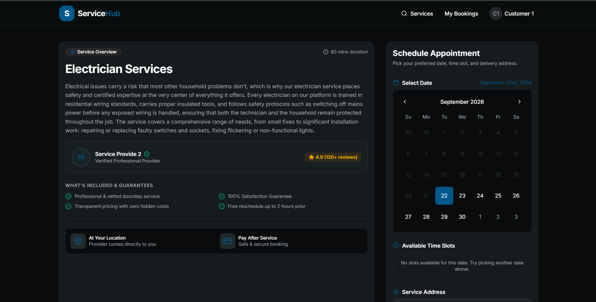
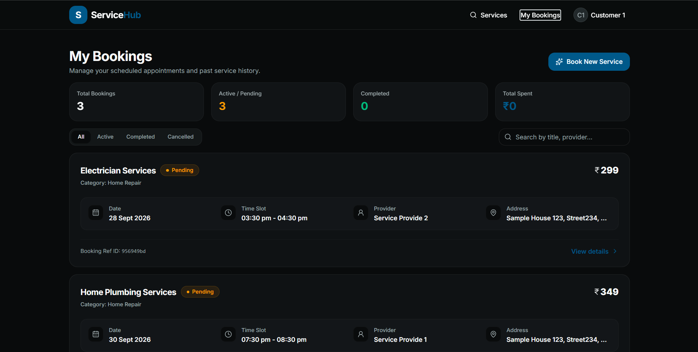
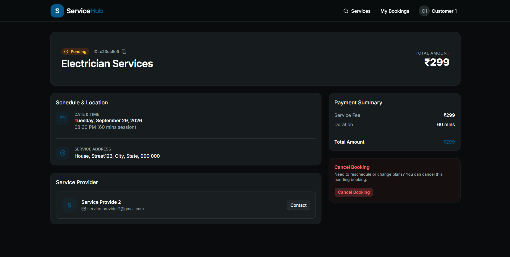

# 🛠️ Service Marketplace

> A full-stack service booking platform where customers can discover local services, check real-time availability, and book providers — built from scratch while transitioning from frontend development into full-stack engineering.

<p align="center">

**🌐 Live Application:** [Service Marketplace](https://service-marketplace-blush.vercel.app/)

  •  

**⚙️ Backend API:** [Render API](https://service-marketplace-ovne.onrender.com/)

</p>

---

## ✨ Overview

Service Marketplace is a production-deployed full-stack web application designed around a simple marketplace workflow:

**Discover → Check Availability → Book → Manage → Review**

Customers can browse services, filter them by category/location/price, view service details, select an available time slot, create bookings, view their bookings, and cancel eligible bookings.

The backend handles authentication, authorization, service management, provider availability, booking conflicts, booking lifecycle, and timezone-safe scheduling.

This project was built as a practical transition from **frontend development into full-stack development**, with a strong focus on understanding backend architecture, data modeling, API design, authentication, business rules, and production deployment.

---

## 🚀 Live Demo

### 🌐 Frontend

**[Open Service Marketplace →](https://service-marketplace-blush.vercel.app/)**

### ⚙️ Backend API

**[Open Backend API →](https://service-marketplace-ovne.onrender.com/)**

> The application is fully deployed with the frontend hosted on Vercel, the backend hosted on Render, and MongoDB Atlas as the production database.

---

## 📸 Application Screenshots


### 🏠 Service Discovery

---

### 🔎 Service Listing & Filters

---

### 📋 Service Details

---

### 📅 Booking & Availability

---

### 📦 My Bookings

---

### 🧾 Booking Details

---

## 🎯 Core Features

### 🔐 Authentication & Authorization

* Customer and provider role-based authentication
* JWT-based authentication
* Protected API routes
* Ownership-based authorization
* Secure password hashing with bcrypt
* Role-specific access to resources

### 🛍️ Service Management

* Create and manage services
* Service ownership validation
* Active/inactive service handling
* Category-based filtering
* City-based filtering
* Price-based filtering
* Pagination
* Service duration configuration

### 📅 Provider Availability

* Provider working-day configuration
* Start/end working hours
* Service-duration-based slot generation
* Date-aware availability
* Past-date protection
* Same-day slot filtering
* Existing booking conflict detection

### 📌 Booking System

* Customer booking creation
* Provider association
* Booking duration calculation
* Booking price snapshot
* Booking address
* Booking status lifecycle
* Booking cancellation
* Customer booking history
* Booking details
* Authorization checks

### ⏰ Timezone-Safe Scheduling

One of the more important engineering challenges in this project was handling timezone consistency.

The application explicitly uses:

```text
Asia/Kolkata
```

for the business timezone.

The booking flow works as:

```text
Customer selects
12:00 PM IST
        ↓
Convert to UTC
06:30 UTC
        ↓
Store in MongoDB
2026-09-22T06:30:00.000Z
        ↓
Convert back to IST
12:00 PM IST
```

This prevents availability, booking creation, and booking display from using inconsistent browser/server timezones.

### ⭐ Reviews

* Review model implemented
* Review API and UI planned as the next feature phase
* Reviews will be tied to completed bookings
* Duplicate review prevention planned
* Rating aggregation planned

---

# 🧠 What I Learned

This project wasn't just about building UI — it was primarily an exercise in understanding how a real full-stack application works from end to end.

### Backend Architecture

Learned how to structure an Express application using:

```text
Routes
   ↓
Controllers
   ↓
Models
   ↓
Database
```

and how authentication middleware, validation, authorization, and business rules fit into that architecture.

### MongoDB & Mongoose

Worked with:

* MongoDB data modeling
* Mongoose schemas
* References between collections
* Population
* Query filtering
* Pagination
* Date queries
* Booking conflict queries
* Transactions

### Authentication

Implemented JWT-based authentication and learned how authentication differs from authorization.

```text
Authentication
"Who are you?"

Authorization
"Are you allowed to do this?"
```

### Booking Business Logic

Learned that a booking system is more than simply inserting a document into MongoDB.

The backend needs to validate:

* Is the service active?
* Is the requested time valid?
* Is the provider available?
* Is the slot already booked?
* Is the booking within the allowed date range?
* Does the user have permission?
* What is the booking duration?
* What should the booking end time be?

### Timezone Handling

One of the biggest lessons from this project was that **time should not depend on the server or browser's local timezone**.

I learned to:

* Represent provider working hours as IST wall-clock time
* Convert selected slots from IST → UTC
* Store timestamps as UTC
* Convert UTC → IST for display
* Compare booking ranges using absolute timestamps
* Calculate "today" using the business timezone

### Frontend ↔ Backend Integration

Worked with:

* REST APIs
* Authentication headers
* API abstraction
* Error handling
* Loading states
* Empty states
* Protected frontend routes
* Backend validation errors

### Production Deployment

This project was also my first opportunity to take a full-stack application through the deployment pipeline:

```text
GitHub
   ↓
Vercel
   ↓
React Frontend
   ↓
Render
   ↓
Express Backend
   ↓
MongoDB Atlas
```

I learned about:

* Production environment variables
* CORS configuration
* Render deployment
* Vercel deployment
* MongoDB Atlas network access
* Production API URLs
* Frontend/backend environment separation
* Production build errors
* TypeScript build validation

---

# 🏗️ Architecture

```text
                         ┌──────────────────┐
                         │     Customer     │
                         │     Provider     │
                         └────────┬─────────┘
                                  │
                                  ▼
                         ┌──────────────────┐
                         │  React Frontend  │
                         │   Vite + TS      │
                         └────────┬─────────┘
                                  │
                              REST API
                                  │
                                  ▼
                         ┌──────────────────┐
                         │ Express Backend  │
                         │   Node.js        │
                         └────────┬─────────┘
                                  │
                  ┌───────────────┼───────────────┐
                  │               │               │
                  ▼               ▼               ▼
             Authentication   Booking Logic   Availability
                  │               │               │
                  └───────────────┼───────────────┘
                                  │
                                  ▼
                         ┌──────────────────┐
                         │    Mongoose      │
                         └────────┬─────────┘
                                  │
                                  ▼
                         ┌──────────────────┐
                         │  MongoDB Atlas   │
                         └──────────────────┘
```

---

# 🧰 Tech Stack

## Frontend

| Technology             | Purpose                        |
| ---------------------- | ------------------------------ |
| React                  | UI development                 |
| TypeScript             | Type-safe frontend development |
| Vite                   | Development & production build |
| React Router           | Client-side routing            |
| Tailwind CSS           | Styling                        |
| shadcn/ui              | Reusable UI components         |
| Lucide React           | Icons                          |
| date-fns / date-fns-tz | Date & timezone handling       |

## Backend

| Technology  | Purpose                 |
| ----------- | ----------------------- |
| Node.js     | Runtime                 |
| Express.js  | REST API                |
| MongoDB     | Database                |
| Mongoose    | ODM                     |
| JWT         | Authentication          |
| bcryptjs    | Password hashing        |
| date-fns-tz | Timezone conversion     |
| CORS        | Cross-origin API access |

---

# ☁️ Deployment

| Layer          | Platform          |
| -------------- | ----------------- |
| Frontend       | **Vercel**        |
| Backend        | **Render**        |
| Database       | **MongoDB Atlas** |
| Source Control | **GitHub**        |

### Production Flow

```text
Git Push
   │
   ├──────────────► Vercel
   │                  │
   │                  ▼
   │             Frontend
   │
   └──────────────► Render
                      │
                      ▼
                   Backend
                      │
                      ▼
                MongoDB Atlas
```

---

# 🔒 Security & Validation

The application includes several backend safeguards:

* JWT authentication
* Password hashing
* Protected routes
* Role-based access
* Resource ownership checks
* Request field validation
* ObjectId validation
* Booking date validation
* Booking overlap prevention
* Active-service validation
* Booking cancellation rules
* Environment-based secrets

Secrets such as:

```text
MONGO_URI
JWT_SECRET
```

are stored as environment variables and are not committed to GitHub.

---

# 📊 Booking Lifecycle

The booking domain follows a defined lifecycle:

```text
                 ┌─────────────┐
                 │   Pending   │
                 └──────┬──────┘
                        │
                        ▼
                 ┌─────────────┐
                 │  Accepted   │
                 └──────┬──────┘
                        │
                        ▼
                 ┌─────────────┐
                 │ In Progress │
                 └──────┬──────┘
                        │
                        ▼
                 ┌─────────────┐
                 │  Completed  │
                 └─────────────┘

Pending
   │
   ▼
Cancelled
```

The backend controls which status transitions are allowed rather than allowing clients to arbitrarily change booking states.

---

# 🗺️ Roadmap

## ✅ Completed

* [x] Authentication
* [x] JWT authorization
* [x] Customer/provider roles
* [x] Service CRUD
* [x] Service filtering
* [x] Pagination
* [x] Provider availability
* [x] Dynamic slot generation
* [x] Booking creation
* [x] Booking conflict prevention
* [x] Booking cancellation
* [x] Booking status lifecycle
* [x] Customer booking history
* [x] Booking details
* [x] IST/UTC timezone handling
* [x] Production deployment

## 🚧 Next

* [ ] Review creation API
* [ ] Review authorization
* [ ] One review per booking
* [ ] Rating aggregation
* [ ] Service reviews UI
* [ ] Provider rating display

## 🔮 Future Improvements

* [ ] Provider dashboard
* [ ] Provider booking management
* [ ] Provider accept/reject workflow
* [ ] Notifications
* [ ] Email notifications
* [ ] Search improvements
* [ ] Favorites / saved services
* [ ] Advanced service discovery
* [ ] Payment integration
* [ ] Image uploads
* [ ] Admin dashboard
* [ ] Analytics
* [ ] Automated testing
* [ ] Rate limiting
* [ ] API documentation with Swagger/OpenAPI

---

# 🔌 API Overview

### Authentication

```text
POST   /auth/user/register
POST   /auth/user/login
```

### Services

```text
GET    /service
GET    /service/:id
POST   /service
PUT    /service/:id
DELETE /service/:id
```

### Availability

```text
GET    /availability
```

### Bookings

```text
POST   /bookings
GET    /bookings
GET    /bookings/:id
PATCH  /bookings/:id/cancel
PATCH  /bookings/:id/status
```

### Reviews

```text
POST   /reviews
GET    /reviews/...
```

> Review endpoints are currently being expanded as part of the next development phase.

---

# 💻 Running Locally

### 1. Clone the repository

```bash
git clone <your-github-repository-url>
cd service-marketplace
```

### 2. Install backend dependencies

```bash
cd backend
npm install
```

### 3. Configure backend environment variables

Create:

```text
backend/.env
```

```env
PORT=5000
MONGO_URI=your_mongodb_connection_string
JWT_SECRET=your_jwt_secret
CLIENT_URL=http://localhost:5173
```

### 4. Start backend

```bash
npm run dev
```

### 5. Install frontend dependencies

```bash
cd ../frontend
npm install
```

### 6. Configure frontend

Create:

```text
frontend/.env
```

```env
VITE_API_URL=http://localhost:5000
```

### 7. Start frontend

```bash
npm run dev
```

---

# 📁 Project Structure

```text
service-marketplace/
│
├── frontend/
│   ├── src/
│   │   ├── api/
│   │   ├── components/
│   │   ├── context/
│   │   ├── pages/
│   │   │   ├── customer/
│   │   │   └── provider/
│   │   ├── utils/
│   │   └── ...
│   └── ...
│
├── backend/
│   ├── config/
│   ├── controllers/
│   ├── middleware/
│   ├── models/
│   ├── routes/
│   ├── utils/
│   ├── app.js
│   ├── server.js
│   └── ...
│
├── docs/
│   └── screenshots/
│
└── README.md
```

---

# 💡 Why I Built This

Instead of building another simple CRUD application, I wanted to understand what happens when a frontend application evolves into a real full-stack product.

The project gave me hands-on experience with:

**UI → API → Authentication → Authorization → Database → Business Logic → Scheduling → Deployment**

The biggest goal was to move beyond simply consuming APIs and start understanding how to **design and build the APIs themselves**.

---

# 📌 Project Highlights

> **4 key areas I focused on while building this project**

### 🧩 Full-Stack Architecture

Designed and connected a React frontend with an Express/MongoDB backend.

### 🔐 Backend Security

Implemented JWT authentication, role-based authorization, ownership checks, and request validation.

### ⏰ Real-World Scheduling

Built provider availability and booking conflict detection with explicit IST/UTC timezone handling.

### ☁️ Production Deployment

Deployed the complete application using Vercel, Render, and MongoDB Atlas.

---

## 👨‍💻 Built By

**Arun Paul**

Frontend Developer transitioning into Full-Stack Development.

Focused on:

`React` · `Next.js` · `TypeScript` · `Node.js` · `Express` · `MongoDB`

---

<p align="center">

### ⭐ If you found this project interesting, feel free to explore the live application and repository.

**Built with React, Node.js, MongoDB — and a lot of debugging.**

</p>
